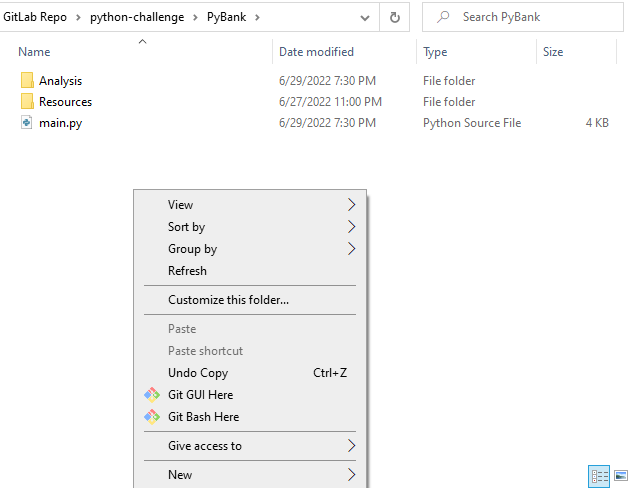
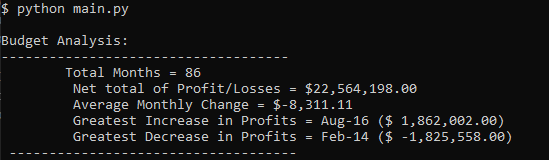
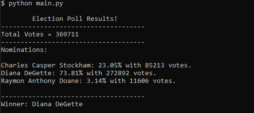

# PyBank: Budget Time!
# PyPoll: Election Day!

## Context
    Welcome all viewers! In this week's challenge assignment there are two activities, PyBank and PyPoll. 
    Each activity will calculate the specified tasks and will output the analysis as a .txt file and print in terminal.
    The task for PyBank is to create a Python script to analyze the financial records of a company. For PyPoll's task, I am to create a Python script to calculate the election polls for a small town. 

## Files:

### PyBank
  
  * [budget_data.csv](PyBank/Resources/budget_data.csv) - Original .csv file
  * [budget_analysis.txt](PyBank/Analysis/budget_analysis.txt) - Calculated analysis .txt file
  * [main.py](Pybank/main.py) - Main script for activity

### PyPoll
  * [election_data.csv](PyPoll/Resources/election_data.csv) - Original .csv file
  * [poll_analysis.txt](PyPoll/Analysis/poll_analysis.txt) - Calculated analysis .txt file
  * [main.py](PyPoll/main.py) - Main script for activity

### Reference Screenshots
  * [Images] - Folder with referenced screenshots

## Setup:

* To run the scripts for each activity, open GitBash terminal for each activity by right clicking in the main folder, and select 'Git Bash Here'
      

* Open main.py for the respective activity in Visual Basics
* In GitBash terminal, type 'python main.py' to run script and viewer will see a printed analysis inside the terminal as well as a .txt file in the 'Analysis' folder. 

* Viewer should see the following images as your results:
      
      

## Requirements for Activities:

### PyBank - 
* Create a script to analyze the financial records. 
* [budget_data.csv](PyBank/Resources/budget_data.csv)
* Columns: "Date" and "Profit/Losses" 

#### Tasks: Calculate each of the following:
* Total number of months
* Net total amount of "Profit/Losses" over entire period
* The changes in "Profit/Losses" over the entire period ( month to month)
* The average of "Profit/Losses"
* The greatest increase in profits (date and amount) over entire period
* The greatest decrease in profits (date and amount) over the entire period
* The final script both print the analysis to terminal and export a .txt file with the results

  ### PyPoll - 
  * [election_data.csv](PyPoll/Resources/election_data.csv)
  * Columns: "Voter ID", "County", "Candidate"
  
  #### Tasks: Create a script that analyzes each of the following:
  
  * The total number of votes cast
  * A complete list of candidates who received votes
  * The percentage of votes each candidate won
  * The total number of votes each candidate won
  * The winner of the election based on popular vote
  * Final script should both print the analysis to the terminal and export a .txt file with the results. 